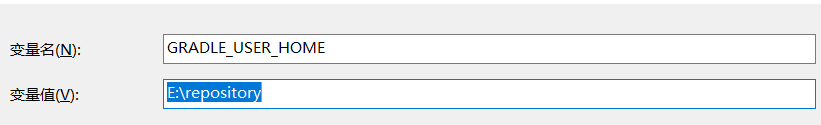

[toc]

#### 1、从[gradle官网](https://gradle.org/releases/)下载gradle-5.6.4.zip压缩包
# 

#### 2、解压缩，配置环境变量，测试是否安装成功

解压到E盘下的Dev-RunTime文件下，并在E:\Dev-RunTime\gradle-5.6.4\init.d路径下创建init.gradle文件
# 


init.gradle文件内容如下

``` txt
allprojects {
    repositories {
        mavenLocal()
        maven { name "Alibaba" ; url "https://maven.aliyun.com/repository/public" }
        maven { name "Bstek" ; url "http://nexus.bsdn.org/content/groups/public/" }
        mavenCentral()
    }

    buildscript { 
        repositories { 
            maven { name "Alibaba" ; url 'https://maven.aliyun.com/repository/public' }
            maven { name "Bstek" ; url 'http://nexus.bsdn.org/content/groups/public/' }
            maven { name "M2" ; url 'https://plugins.gradle.org/m2/' }
        }
    }
}
```

新建GRADLE_HOME环境变量

# 
新建GRADLE_USER_HOME环境变量指向的位置为jar仓库，可以为你的maven仓库
# 


Path环境变量追加如下

# 


测试是否安装成功

# 
#### 3、使用Git克隆GitHub上spring源码

# 
```bash
git clone -b 5.2.x https://github.com/spring-projects/spring-framework.git  #克隆spring官方仓库的5.2.x分支
```

#### 4、预编译spring-oxm

进入项目的根路径下执行如下命令

```bash
./gradlew :spring-oxm:compileTestJava
```

可以参考克隆下来的的spring源码项目根目录的下的**import-into-idea.md**文件

#### 5、导入idea,并设置gradle
# 

# 

#### 6、等待构建完成即可

> 可能会出现aspect报错的问题，需要对应的aspect的jar包
>
> 网络不好的情况下，可能会构建失败
